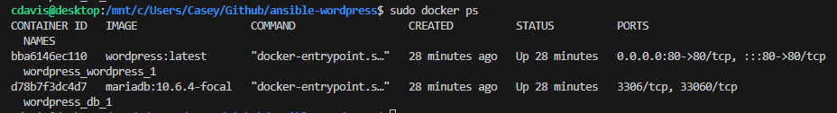

# ansible-wordpress
Creating an instance of Wordpress inside a Docker container using Ansible

I started with a clean install of Ubuntu on Windows Subsystem for Linux, then ran prerequistes commands

Prerequisites
- sudo apt update
- sudo apt upgrade
- sudo apt install ansible

Clone repository
```
git clone https://github.com/caseyjdavis/ansible-wordpress.git
```

Run the playbook
```
cd ansible-wordpress/
sudo ansible-playbook dockerwordpressplaybook.yml
```

Installs
- MariaDB
- Nginx
- PHP
- Wordpress latest

### Command prompt output


### Welcome Screen for Wordpress


### Docker process monitor

